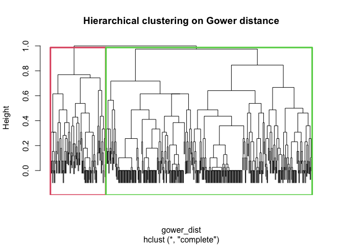
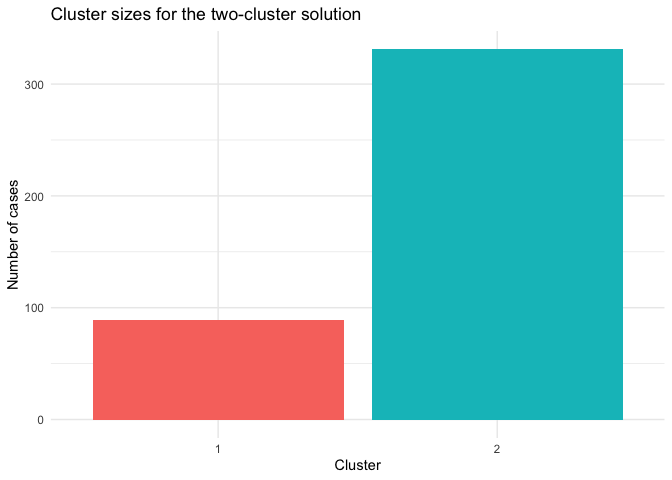
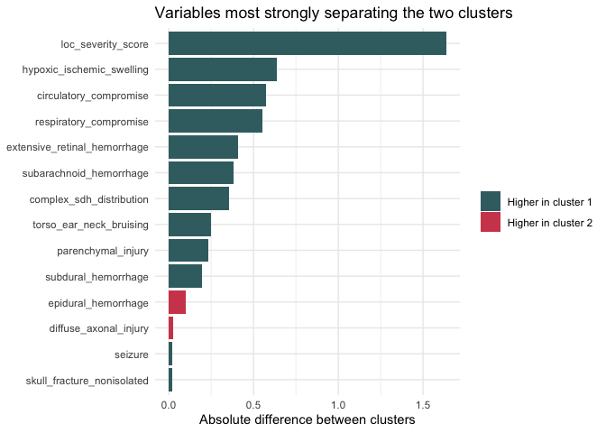
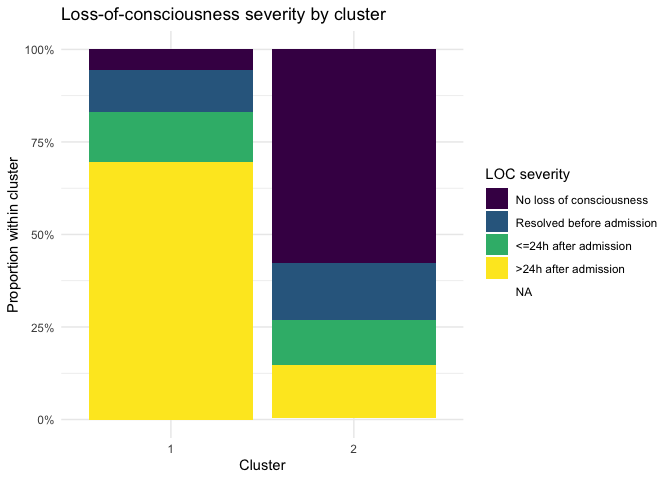
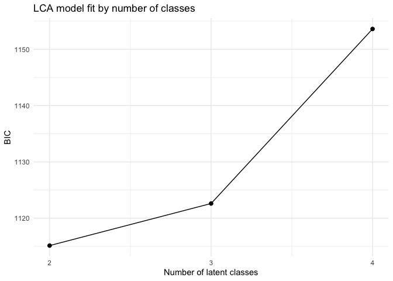
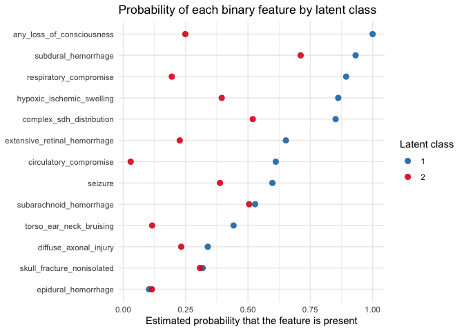
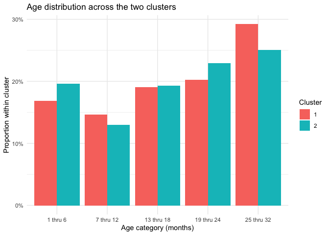

# README
Maria Cuellar
2026-03-11

- [<span class="toc-section-number">1</span> Overview](#overview)
- [<span class="toc-section-number">2</span> Data](#data)
- [<span class="toc-section-number">3</span> Data
  Preparation](#data-preparation)
- [<span class="toc-section-number">4</span> Clustering
  Analysis](#clustering-analysis)
- [<span class="toc-section-number">5</span> Results](#results)
  - [<span class="toc-section-number">5.1</span> Three-Cluster and
    Four-Cluster Checks](#three-cluster-and-four-cluster-checks)
  - [<span class="toc-section-number">5.2</span> Latent Class
    Analysis](#latent-class-analysis)
  - [<span class="toc-section-number">5.3</span> Age Distribution by
    Cluster](#age-distribution-by-cluster)
- [<span class="toc-section-number">6</span> Discussion](#discussion)
  - [<span class="toc-section-number">6.1</span> Causal
    Interpretation](#causal-interpretation)
- [<span class="toc-section-number">7</span> Next Steps](#next-steps)

``` r
library(tidyverse)
library(readxl)
library(cluster)
library(knitr)
library(poLCA)
```

# Overview

This document replicates the Boos clustering analysis as closely as
possible with the variables available in `Data/Data.xlsx`.

Because the exact feature list and clustering settings from the paper
have not yet been fully extracted from the PDF, this file uses an
explicit Boos-style approximation:

- Combine the eligible control and intervention sheets into one analysis
  dataset.
- Use clinically relevant binary and ordinal variables that appear to
  match the paper’s clustering inputs.
- Compute a Gower dissimilarity matrix.
- Fit agglomerative hierarchical clustering and inspect candidate values
  of `k`.
- Force the Boos two-cluster solution and summarize the resulting
  cluster profiles.

The key design choice is that every clustering variable is defined in
one place below, so the analysis can be tightened once you confirm the
exact variables in the article.

# Data

This dataset consists of 420 cases from the PediBIRN network data. It is
the same underlying dataset used in the Hymel et al. and Boos et
al. analyses and includes clinical and radiologic variables relevant to
abusive head trauma, intracranial injury, and related findings. In this
project, the data are used to examine whether unsupervised clustering
methods identify groupings that appear to reflect abuse-specific
findings, severity of intracranial pathology, or some combination of
both.

``` r
dat_control <- read_excel("Data/Data.xlsx", sheet = "Eligible Control Patients") |>
  mutate(data_source = "control")

dat_treatment <- read_excel("Data/Data.xlsx", sheet = "Eligible Intervention Patients") |>
  mutate(data_source = "intervention")

dat_raw <- bind_rows(dat_control, dat_treatment)

nrow(dat_raw)
```

    [1] 432

# Data Preparation

``` r
feature_map <- c(
  patient_id = "Patient ID",
  age_months = "Months",
  respiratory_compromise = "Q4.2.1.                                    Any clinically-significant respiratory compromise at the scene of injury, during transport, in the ED, or prior to hospital admission?",
  circulatory_compromise = "Q4.2.2.                               Any clinically-significant circulatory compromise at the scene of injury, during transport, in the ED, or prior to hospital admission?",
  seizure = "Q4.2.3.                        Seizure(s) at the scene of injury, during transport, in the ED, or prior to hospital admission?",
  loc_present = "Q4.2.4.                                     A clear impairment or loss of consciousness at the scene of injury, during transport, in the ED, or prior to hospital admission?",
  loc_resolved_pre_admission = "Q4.2.5.                                      Did this child's clear impairment or loss of consciousness resolve prior to hospital admission?",
  loc_gt_24h = "Q4.2.6.                             Did this child's clear impairment or loss of consciousness last >24 hours after admission?",
  loc_posturing = "Q4.2.7.                          Was this child's clear impairment or loss of consciousness ever associated with flaccidity, decorticate or decerebrate posturing?",
  torso_ear_neck_bruising = "Q4.3.2.                      Any bruising involving the child's ear(s), neck or torso?",
  skull_fracture = "Q4.4.1.                                 Any skull fracture(s)?",
  isolated_linear_parietal_fracture = "Q4.4.2.1.                                          What skull fracture(s) did the child manifest?                                    Only an isolated, unilateral, nondiastatic, linear, parietal skull fracture?",
  epidural_hemorrhage = "Q4.4.3.                                        Any epidural hemorrhage(s)?",
  subdural_hemorrhage = "Q4.4.4.                             Any subdural hemorrhage(s) or fluid collection(s)?",
  bilateral_sdh = "Q4.4.5.2.                           Bilateral, overlying both cerebral hemispheres?",
  interhemispheric_sdh = "Q4.4.5.3                                     Involving or extending from the interhemispheric space?",
  subarachnoid_hemorrhage = "Q4.4.7.                         Any subarachnoid hemorrhage(s)?",
  parenchymal_injury = "Q4.4.8.                             Any brain parenchymal contusion(s), laceration(s) or hemorrhage(s)?",
  diffuse_axonal_injury = "Q4.4.11.                                   Are these brain parenchymal contusion(s), laceration(s) or hemorrhage(s) reasonably characterized as diffuse traumatic axonal injury?",
  hypoxic_ischemic_swelling = "Q4.4.12.                                    Any brain hypoxia, ischemia and/or swelling?",
  extensive_retinal_hemorrhage = "Q5.3.2.9.                       Retinal hemorrhage(s) described by an ophthalmologist as dense, extensive, covering a large surface area and/or extending to the ora serrata?"
)

required_columns <- unname(feature_map)
missing_columns <- setdiff(required_columns, names(dat_raw))
missing_columns
```

    character(0)

``` r
to_binary_factor <- function(x) {
  case_when(
    is.na(x) ~ NA_character_,
    x == 1 ~ "Yes",
    x == 0 ~ "No",
    TRUE ~ as.character(x)
  ) |>
    factor(levels = c("No", "Yes"))
}

relabel_by_loc_severity <- function(cluster, loc_severity) {
  cluster_map <- tibble(
    cluster = as.character(cluster),
    loc_score = as.numeric(loc_severity)
  ) |>
    group_by(cluster) |>
    summarise(mean_loc_score = mean(loc_score, na.rm = TRUE), .groups = "drop") |>
    arrange(desc(mean_loc_score), cluster)

  factor(
    cluster,
    levels = cluster_map$cluster,
    labels = seq_len(nrow(cluster_map))
  )
}

dat_analysis <- dat_raw |>
  transmute(
    patient_id = .data[[feature_map["patient_id"]]],
    data_source,
    age_months = .data[[feature_map["age_months"]]],
    respiratory_compromise = to_binary_factor(.data[[feature_map["respiratory_compromise"]]]),
    circulatory_compromise = to_binary_factor(.data[[feature_map["circulatory_compromise"]]]),
    seizure = to_binary_factor(.data[[feature_map["seizure"]]]),
    torso_ear_neck_bruising = to_binary_factor(.data[[feature_map["torso_ear_neck_bruising"]]]),
    skull_fracture_nonisolated = case_when(
      .data[[feature_map["skull_fracture"]]] == 0 ~ "No",
      .data[[feature_map["skull_fracture"]]] == 1 &
        .data[[feature_map["isolated_linear_parietal_fracture"]]] == 1 ~ "No",
      .data[[feature_map["skull_fracture"]]] == 1 ~ "Yes",
      TRUE ~ NA_character_
    ) |> factor(levels = c("No", "Yes")),
    epidural_hemorrhage = to_binary_factor(.data[[feature_map["epidural_hemorrhage"]]]),
    subdural_hemorrhage = to_binary_factor(.data[[feature_map["subdural_hemorrhage"]]]),
    complex_sdh_distribution = case_when(
      .data[[feature_map["subdural_hemorrhage"]]] == 0 ~ "No",
      .data[[feature_map["bilateral_sdh"]]] == 1 |
        .data[[feature_map["interhemispheric_sdh"]]] == 1 ~ "Yes",
      .data[[feature_map["subdural_hemorrhage"]]] == 1 ~ "No",
      TRUE ~ NA_character_
    ) |> factor(levels = c("No", "Yes")),
    subarachnoid_hemorrhage = to_binary_factor(.data[[feature_map["subarachnoid_hemorrhage"]]]),
    parenchymal_injury = to_binary_factor(.data[[feature_map["parenchymal_injury"]]]),
    diffuse_axonal_injury = to_binary_factor(.data[[feature_map["diffuse_axonal_injury"]]]),
    hypoxic_ischemic_swelling = to_binary_factor(.data[[feature_map["hypoxic_ischemic_swelling"]]]),
    extensive_retinal_hemorrhage = to_binary_factor(.data[[feature_map["extensive_retinal_hemorrhage"]]]),
    loc_severity = case_when(
      .data[[feature_map["loc_present"]]] == 0 ~ "No loss of consciousness",
      .data[[feature_map["loc_present"]]] == 1 &
        .data[[feature_map["loc_resolved_pre_admission"]]] == 1 ~ "Resolved before admission",
      .data[[feature_map["loc_present"]]] == 1 &
        .data[[feature_map["loc_gt_24h"]]] == 1 ~ ">24h after admission",
      .data[[feature_map["loc_present"]]] == 1 &
        .data[[feature_map["loc_posturing"]]] == 1 ~ ">24h after admission",
      .data[[feature_map["loc_present"]]] == 1 ~ "<=24h after admission",
      TRUE ~ NA_character_
    ) |> ordered(levels = c(
      "No loss of consciousness",
      "Resolved before admission",
      "<=24h after admission",
      ">24h after admission"
    ))
  ) |>
  mutate(
    patient_id = coalesce(as.character(patient_id), paste0("row_", row_number()))
  )

cluster_vars <- c(
  "respiratory_compromise",
  "circulatory_compromise",
  "seizure",
  "torso_ear_neck_bruising",
  "skull_fracture_nonisolated",
  "epidural_hemorrhage",
  "subdural_hemorrhage",
  "complex_sdh_distribution",
  "subarachnoid_hemorrhage",
  "parenchymal_injury",
  "diffuse_axonal_injury",
  "hypoxic_ischemic_swelling",
  "extensive_retinal_hemorrhage",
  "loc_severity"
)

dat_cluster <- dat_analysis |>
  filter(if_any(all_of(cluster_vars), ~ !is.na(.x)))

missingness_summary <- dat_cluster |>
  summarise(across(all_of(cluster_vars), ~ mean(is.na(.x)))) |>
  pivot_longer(everything(), names_to = "variable", values_to = "missing_fraction") |>
  arrange(desc(missing_fraction))
  
kable(missingness_summary, digits = 2, caption = "Table 1. Clustering variables and missingness")
```

| variable                     | missing_fraction |
|:-----------------------------|-----------------:|
| diffuse_axonal_injury        |             0.85 |
| respiratory_compromise       |             0.00 |
| circulatory_compromise       |             0.00 |
| seizure                      |             0.00 |
| torso_ear_neck_bruising      |             0.00 |
| loc_severity                 |             0.00 |
| skull_fracture_nonisolated   |             0.00 |
| epidural_hemorrhage          |             0.00 |
| subdural_hemorrhage          |             0.00 |
| complex_sdh_distribution     |             0.00 |
| subarachnoid_hemorrhage      |             0.00 |
| parenchymal_injury           |             0.00 |
| hypoxic_ischemic_swelling    |             0.00 |
| extensive_retinal_hemorrhage |             0.00 |

Table 1. Clustering variables and missingness

In the data-preparation step, the eligible control and intervention
sheets were first combined into a single analysis dataset. I then
selected a set of clinical and radiologic variables that most closely
matched the features used in the Boos clustering analysis and recoded
them into a form suitable for unsupervised clustering. Most variables
were converted to binary indicators (`Yes`/`No`), while loss of
consciousness was collapsed into an ordinal severity variable with
categories for none, resolved before admission, less than or equal to 24
hours after admission, and greater than 24 hours after admission. I also
derived a small number of composite variables, such as non-isolated
skull fracture and complex subdural hemorrhage distribution, to better
capture clinically meaningful patterns. Finally, I reviewed missingness
across the selected variables so the clustering results could be
interpreted with the degree of data completeness in mind.

The table below lists the variables included in the clustering analysis
and shows the proportion of missing values for each one. This provides a
quick check of the feature set used to construct the Gower distance
matrix and highlights where incomplete data may affect the clustering
results.

# Clustering Analysis

``` r
cluster_input <- dat_cluster |>
  dplyr::select(all_of(cluster_vars))

gower_dist <- daisy(cluster_input, metric = "gower")
hclust_fit <- hclust(gower_dist, method = "complete")

candidate_k <- 2:6

silhouette_tbl <- map_dfr(candidate_k, function(k) {
  assignment <- cutree(hclust_fit, k = k)
  sil <- silhouette(assignment, gower_dist)
  tibble(
    k = k,
    average_silhouette_width = summary(sil)$avg.width
  )
})

kable(silhouette_tbl, digits = 3, caption = "Table 2. Average silhouette width by number of clusters")
```

|   k | average_silhouette_width |
|----:|-------------------------:|
|   2 |                    0.265 |
|   3 |                    0.191 |
|   4 |                    0.178 |
|   5 |                    0.182 |
|   6 |                    0.185 |

Table 2. Average silhouette width by number of clusters

``` r
best_k <- silhouette_tbl |>
  slice_max(average_silhouette_width, n = 1, with_ties = FALSE) |>
  pull(k)

best_k
```

    [1] 2

Among the cluster solutions examined, the two-cluster solution had the
highest average silhouette width, with a value of 0.265 compared with
lower values for three through six clusters. This indicates that,
relative to the other candidate solutions, a two-cluster structure
provides the best fit to the data under this clustering approach.
However, the silhouette value remains fairly low in absolute terms,
which suggests that separation between clusters is modest rather than
strong. In other words, the data are more consistent with two clusters
than with larger numbers of clusters, but they do not show evidence of
two sharply distinct or highly natural groupings.

``` r
dat_cluster <- dat_cluster |>
  mutate(
    cluster_2 = relabel_by_loc_severity(cutree(hclust_fit, k = 2), loc_severity),
    cluster_3 = relabel_by_loc_severity(cutree(hclust_fit, k = 3), loc_severity),
    cluster_4 = relabel_by_loc_severity(cutree(hclust_fit, k = 4), loc_severity),
    cluster_best = factor(cutree(hclust_fit, k = best_k))
  )
```

# Results

``` r
plot(hclust_fit, labels = FALSE, main = "Hierarchical clustering on Gower distance")
par(lwd = 3)
rect.hclust(hclust_fit, k = 2, border = 2:3)
```



``` r
par(lwd = 1)
```

This plot shows the hierarchical clustering structure of the cases based
on the Gower dissimilarity matrix. Each branch represents how similar or
dissimilar cases are, with branches joining lower in the tree indicating
greater similarity. The rectangles show the two-cluster solution
obtained by cutting the dendrogram at `k = 2`, which is the solution
carried forward for the main cluster summaries below.

``` r
cluster_size_tbl <- dat_cluster |>
  count(cluster_2, name = "n") |>
  mutate(prop = n / sum(n))

kable(cluster_size_tbl, digits = 3, caption = "Table 3. Cluster sizes for the two-cluster solution")
```

| cluster_2 |   n |  prop |
|:----------|----:|------:|
| 1         |  89 | 0.212 |
| 2         | 331 | 0.788 |

Table 3. Cluster sizes for the two-cluster solution

``` r
ggplot(cluster_size_tbl, aes(x = cluster_2, y = n, fill = cluster_2)) +
  geom_col(show.legend = FALSE) +
  labs(
    title = "Cluster sizes for the two-cluster solution",
    x = "Cluster",
    y = "Number of cases"
  ) +
  theme_minimal()
```



This plot shows the size of each cluster in the two-cluster solution. It
makes the imbalance between the two groups easier to see than the table
alone.

``` r
driver_table_binary <- dat_cluster |>
  mutate(across(all_of(cluster_vars[cluster_vars != "loc_severity"]), ~ .x == "Yes")) |>
  pivot_longer(
    cols = all_of(cluster_vars[cluster_vars != "loc_severity"]),
    names_to = "variable",
    values_to = "value"
  ) |>
  group_by(variable, cluster_2) |>
  summarise(proportion_yes = mean(value, na.rm = TRUE), .groups = "drop") |>
  pivot_wider(names_from = cluster_2, values_from = proportion_yes, names_prefix = "cluster_") |>
  mutate(
    difference = cluster_2 - cluster_1,
    abs_difference = abs(difference)
  )

driver_table_loc <- dat_cluster |>
  transmute(
    variable = "loc_severity_score",
    cluster_2,
    value = as.numeric(loc_severity) - 1
  ) |>
  group_by(variable, cluster_2) |>
  summarise(mean_score = mean(value, na.rm = TRUE), .groups = "drop") |>
  pivot_wider(names_from = cluster_2, values_from = mean_score, names_prefix = "cluster_") |>
  mutate(
    difference = cluster_2 - cluster_1,
    abs_difference = abs(difference)
  )

driver_table <- bind_rows(driver_table_binary, driver_table_loc) |>
  arrange(desc(abs_difference))

kable(driver_table, digits = 3, caption = "Table 5. Variables ranked by separation between clusters")
```

| variable                     | cluster_1 | cluster_2 | difference | abs_difference |
|:-----------------------------|----------:|----------:|-----------:|---------------:|
| loc_severity_score           |     2.472 |     0.833 |     -1.639 |          1.639 |
| hypoxic_ischemic_swelling    |     0.843 |     0.202 |     -0.640 |          0.640 |
| circulatory_compromise       |     0.742 |     0.167 |     -0.575 |          0.575 |
| respiratory_compromise       |     0.865 |     0.312 |     -0.553 |          0.553 |
| extensive_retinal_hemorrhage |     0.640 |     0.230 |     -0.411 |          0.411 |
| subarachnoid_hemorrhage      |     0.607 |     0.224 |     -0.383 |          0.383 |
| complex_sdh_distribution     |     0.809 |     0.453 |     -0.356 |          0.356 |
| torso_ear_neck_bruising      |     0.393 |     0.142 |     -0.251 |          0.251 |
| parenchymal_injury           |     0.337 |     0.103 |     -0.234 |          0.234 |
| subdural_hemorrhage          |     0.876 |     0.680 |     -0.197 |          0.197 |
| epidural_hemorrhage          |     0.067 |     0.169 |      0.102 |          0.102 |
| diffuse_axonal_injury        |     0.267 |     0.294 |      0.027 |          0.027 |
| seizure                      |     0.348 |     0.327 |     -0.021 |          0.021 |
| skull_fracture_nonisolated   |     0.303 |     0.284 |     -0.019 |          0.019 |

Table 5. Variables ranked by separation between clusters

This table ranks the clustering variables by how strongly they differ
between the two clusters. For the binary variables, the values are the
proportion of patients with that feature in each cluster; for
`loc_severity_score`, the values are the mean ordinal
loss-of-consciousness score, with higher values indicating greater
severity. Variables near the top of this table are the most plausible
drivers of the two-cluster split, which helps assess whether the
separation appears to reflect abuse-related findings, neurologic
severity, or some other pattern.

``` r
driver_plot_tbl <- driver_table |>
  mutate(
    variable = fct_reorder(variable, abs_difference)
  )

ggplot(driver_plot_tbl, aes(x = abs_difference, y = variable, fill = difference > 0)) +
  geom_col() +
  scale_fill_manual(
    values = c("#3C6E71", "#D1495B"),
    labels = c("Higher in cluster 1", "Higher in cluster 2"),
    name = NULL
  ) +
  labs(
    title = "Variables most strongly separating the two clusters",
    x = "Absolute difference between clusters",
    y = NULL
  ) +
  theme_minimal()
```



This plot visualizes the variables that most strongly distinguish the
two clusters. Longer bars indicate larger differences between cluster 1
and cluster 2, making it easier to see whether the separation is being
driven primarily by neurologic severity variables, abuse-correlated
findings, or a mixture of both.

``` r
table1_loc <- dat_cluster |>
  count(cluster_2, loc_severity) |>
  group_by(cluster_2) |>
  mutate(prop = n / sum(n)) |>
  ungroup()

kable(table1_loc, digits = 3, caption = "Table 6. Loss-of-consciousness severity by cluster")
```

| cluster_2 | loc_severity              |   n |  prop |
|:----------|:--------------------------|----:|------:|
| 1         | No loss of consciousness  |   5 | 0.056 |
| 1         | Resolved before admission |  10 | 0.112 |
| 1         | \<=24h after admission    |  12 | 0.135 |
| 1         | \>24h after admission     |  62 | 0.697 |
| 2         | No loss of consciousness  | 191 | 0.577 |
| 2         | Resolved before admission |  51 | 0.154 |
| 2         | \<=24h after admission    |  40 | 0.121 |
| 2         | \>24h after admission     |  48 | 0.145 |
| 2         | NA                        |   1 | 0.003 |

Table 6. Loss-of-consciousness severity by cluster

``` r
ggplot(table1_loc, aes(x = cluster_2, y = prop, fill = loc_severity)) +
  geom_col() +
  scale_y_continuous(labels = scales::percent_format(accuracy = 1)) +
  labs(
    title = "Loss-of-consciousness severity by cluster",
    x = "Cluster",
    y = "Proportion within cluster",
    fill = "LOC severity"
  ) +
  theme_minimal()
```



This stacked bar chart makes the loss-of-consciousness severity profile
of each cluster easier to compare visually. It shows how much each
severity category contributes to the composition of each cluster.

This table shows the distribution of loss-of-consciousness severity
across the two clusters. In the current results, `loc_severity` appears
to be strongly associated with cluster membership: cluster 1 is
dominated by patients with loss of consciousness lasting more than 24
hours after admission, whereas cluster 2 is dominated by patients with
no loss of consciousness. This suggests that level of neurologic
compromise is an important contributor to the observed separation
between clusters.

## Three-Cluster and Four-Cluster Checks

``` r
table_loc_3 <- dat_cluster |>
  count(cluster_3, loc_severity) |>
  group_by(cluster_3) |>
  mutate(prop = n / sum(n)) |>
  ungroup()

kable(table_loc_3, digits = 3, caption = "Table 7. Loss-of-consciousness severity in the three-cluster solution")
```

| cluster_3 | loc_severity              |   n |  prop |
|:----------|:--------------------------|----:|------:|
| 1         | No loss of consciousness  |   5 | 0.056 |
| 1         | Resolved before admission |  10 | 0.112 |
| 1         | \<=24h after admission    |  12 | 0.135 |
| 1         | \>24h after admission     |  62 | 0.697 |
| 2         | No loss of consciousness  |  96 | 0.500 |
| 2         | Resolved before admission |  34 | 0.177 |
| 2         | \<=24h after admission    |  18 | 0.094 |
| 2         | \>24h after admission     |  43 | 0.224 |
| 2         | NA                        |   1 | 0.005 |
| 3         | No loss of consciousness  |  95 | 0.683 |
| 3         | Resolved before admission |  17 | 0.122 |
| 3         | \<=24h after admission    |  22 | 0.158 |
| 3         | \>24h after admission     |   5 | 0.036 |

Table 7. Loss-of-consciousness severity in the three-cluster solution

This table shows the distribution of loss-of-consciousness severity
across the three-cluster solution. In the current results, one cluster
remains strongly dominated by prolonged loss of consciousness lasting
more than 24 hours after admission, while the other two clusters contain
much larger proportions of patients with no loss of consciousness. This
suggests that loss-of-consciousness severity continues to matter even
when the data are partitioned into three clusters.

``` r
table_loc_4 <- dat_cluster |>
  count(cluster_4, loc_severity) |>
  group_by(cluster_4) |>
  mutate(prop = n / sum(n)) |>
  ungroup()

kable(table_loc_4, digits = 3, caption = "Table 8. Loss-of-consciousness severity in the four-cluster solution")
```

| cluster_4 | loc_severity              |   n |  prop |
|:----------|:--------------------------|----:|------:|
| 1         | No loss of consciousness  |   5 | 0.056 |
| 1         | Resolved before admission |  10 | 0.112 |
| 1         | \<=24h after admission    |  12 | 0.135 |
| 1         | \>24h after admission     |  62 | 0.697 |
| 2         | No loss of consciousness  |   8 | 0.105 |
| 2         | Resolved before admission |  10 | 0.132 |
| 2         | \<=24h after admission    |  14 | 0.184 |
| 2         | \>24h after admission     |  43 | 0.566 |
| 2         | NA                        |   1 | 0.013 |
| 3         | No loss of consciousness  |  95 | 0.683 |
| 3         | Resolved before admission |  17 | 0.122 |
| 3         | \<=24h after admission    |  22 | 0.158 |
| 3         | \>24h after admission     |   5 | 0.036 |
| 4         | No loss of consciousness  |  88 | 0.759 |
| 4         | Resolved before admission |  24 | 0.207 |
| 4         | \<=24h after admission    |   4 | 0.034 |

Table 8. Loss-of-consciousness severity in the four-cluster solution

This table shows the distribution of loss-of-consciousness severity
across the four-cluster solution. In the current results, the
four-cluster analysis still retains a cluster dominated by prolonged
loss of consciousness, while the other clusters are more concentrated in
the lower-severity categories, especially no loss of consciousness.
Taken together, the three-cluster and four-cluster solutions suggest
that loss of consciousness remains an important organizing feature of
the clustering structure rather than being an artifact of forcing only
two clusters.

## Latent Class Analysis

``` r
lca_vars <- c(
  "respiratory_compromise",
  "circulatory_compromise",
  "seizure",
  "torso_ear_neck_bruising",
  "skull_fracture_nonisolated",
  "epidural_hemorrhage",
  "subdural_hemorrhage",
  "complex_sdh_distribution",
  "subarachnoid_hemorrhage",
  "parenchymal_injury",
  "diffuse_axonal_injury",
  "hypoxic_ischemic_swelling",
  "extensive_retinal_hemorrhage",
  "loc_severity"
)

lca_data <- dat_cluster |>
  transmute(
    patient_id,
    respiratory_compromise = as.integer(respiratory_compromise),
    circulatory_compromise = as.integer(circulatory_compromise),
    seizure = as.integer(seizure),
    torso_ear_neck_bruising = as.integer(torso_ear_neck_bruising),
    skull_fracture_nonisolated = as.integer(skull_fracture_nonisolated),
    epidural_hemorrhage = as.integer(epidural_hemorrhage),
    subdural_hemorrhage = as.integer(subdural_hemorrhage),
    complex_sdh_distribution = as.integer(complex_sdh_distribution),
    subarachnoid_hemorrhage = as.integer(subarachnoid_hemorrhage),
    parenchymal_injury = as.integer(parenchymal_injury),
    diffuse_axonal_injury = as.integer(diffuse_axonal_injury),
    hypoxic_ischemic_swelling = as.integer(hypoxic_ischemic_swelling),
    extensive_retinal_hemorrhage = as.integer(extensive_retinal_hemorrhage),
    loc_severity = as.integer(loc_severity)
  ) |>
  drop_na(all_of(lca_vars))

lca_n <- nrow(lca_data)
lca_n
```

    [1] 64

This section applies latent class analysis as an alternative
unsupervised method for the same set of categorical variables. Because
`poLCA` requires complete data on the manifest variables included in the
model, this analysis is restricted to complete cases for the selected
feature set.

``` r
lca_formula <- as.formula(
  paste("cbind(", paste(lca_vars, collapse = ", "), ") ~ 1")
)

set.seed(123)

lca_fits <- map(
  2:4,
  ~ poLCA(
    lca_formula,
    data = lca_data,
    nclass = .x,
    nrep = 5,
    maxiter = 3000,
    verbose = FALSE,
    calc.se = FALSE
  )
)
```


     ALERT: at least one manifest variable contained only one
        outcome category, and has been removed from the analysis. 


     ALERT: at least one manifest variable contained only one
        outcome category, and has been removed from the analysis. 


     ALERT: at least one manifest variable contained only one
        outcome category, and has been removed from the analysis. 

``` r
lca_fit_tbl <- map2_dfr(
  lca_fits,
  2:4,
  ~ tibble(
    nclass = .y,
    aic = .x$aic,
    bic = .x$bic,
    g_squared = .x$Gsq
  )
)

kable(lca_fit_tbl, digits = 2, caption = "Table 9. Latent class model fit statistics")
```

| nclass |     aic |     bic | g_squared |
|-------:|--------:|--------:|----------:|
|      2 | 1048.21 | 1115.14 |    462.19 |
|      3 | 1021.14 | 1122.61 |    403.12 |
|      4 | 1017.60 | 1153.61 |    367.58 |

Table 9. Latent class model fit statistics

``` r
ggplot(lca_fit_tbl, aes(x = nclass, y = bic)) +
  geom_line() +
  geom_point(size = 2) +
  scale_x_continuous(breaks = lca_fit_tbl$nclass) +
  labs(
    title = "LCA model fit by number of classes",
    x = "Number of latent classes",
    y = "BIC"
  ) +
  theme_minimal()
```



This plot shows how the LCA model-fit criterion changes as the number of
latent classes increases. Lower values indicate a better tradeoff
between fit and complexity, so the lowest point marks the preferred
solution by BIC.

This table summarizes model-fit statistics for the latent class models
with two, three, and four classes. Lower BIC values indicate a better
balance between fit and complexity. In the current results, the
two-class LCA solution has the lowest BIC, which is consistent with the
earlier hierarchical clustering diagnostics.

``` r
best_lca_k <- lca_fit_tbl |>
  slice_min(bic, n = 1, with_ties = FALSE) |>
  pull(nclass)

best_lca <- lca_fits[[best_lca_k - 1]]

lca_results <- lca_data |>
  mutate(lca_class_raw = factor(best_lca$predclass))

lca_class_map <- lca_results |>
  group_by(lca_class_raw) |>
  summarise(mean_loc_score = mean(loc_severity, na.rm = TRUE), .groups = "drop") |>
  arrange(desc(mean_loc_score), lca_class_raw)

lca_results <- lca_results |>
  mutate(
    lca_class = factor(
      lca_class_raw,
      levels = lca_class_map$lca_class_raw,
      labels = seq_len(nrow(lca_class_map))
    )
  )

lca_loc_tbl <- lca_results |>
  count(lca_class, loc_severity) |>
  group_by(lca_class) |>
  mutate(prop = n / sum(n)) |>
  ungroup()

kable(lca_loc_tbl, digits = 3, caption = "Table 10. Loss-of-consciousness severity in the best-fitting latent class solution")
```

| lca_class | loc_severity |   n |  prop |
|:----------|-------------:|----:|------:|
| 1         |            2 |   2 | 0.069 |
| 1         |            3 |   3 | 0.103 |
| 1         |            4 |  24 | 0.828 |
| 2         |            1 |  26 | 0.743 |
| 2         |            2 |   4 | 0.114 |
| 2         |            3 |   5 | 0.143 |

Table 10. Loss-of-consciousness severity in the best-fitting latent
class solution

This table shows the distribution of loss-of-consciousness severity
within the best-fitting latent class solution. In the current results,
one latent class is dominated by the highest loss-of-consciousness
severity category, while another is dominated by the absence of loss of
consciousness. This suggests that the prominence of neurologic severity
is not unique to hierarchical clustering and persists under a different
unsupervised method.

``` r
lca_item_prob_tbl <- imap_dfr(
  best_lca$probs,
  ~ {
    prob_mat <- as.data.frame(.x)
    prob_mat$class_raw <- rownames(prob_mat)
    prob_mat |>
      pivot_longer(
        cols = starts_with("Pr("),
        names_to = "response",
        values_to = "probability"
      ) |>
      mutate(variable = .y)
  }
) |>
  mutate(
    response = factor(response, levels = unique(response)),
    class_raw = factor(class_raw, levels = rownames(best_lca$probs[[1]]))
  )

lca_plot_class_map <- tibble(
  class_raw = factor(
    paste0("class ", as.character(lca_class_map$lca_class_raw), ": "),
    levels = levels(lca_item_prob_tbl$class_raw)
  ),
  class = factor(seq_len(nrow(lca_class_map)))
)

lca_binary_prob_tbl <- lca_item_prob_tbl |>
  filter(
    (variable != "loc_severity" & response == "Pr(2)") |
      (variable == "loc_severity" & response != "Pr(1)")
  ) |>
  mutate(
    variable = if_else(variable == "loc_severity", "any_loss_of_consciousness", variable)
  ) |>
  left_join(lca_plot_class_map, by = "class_raw") |>
  group_by(class, variable) |>
  summarise(probability = sum(probability), .groups = "drop") |>
  group_by(variable) |>
  mutate(
    class1_probability = probability[class == "1"][1]
  ) |>
  ungroup()

lca_variable_order <- lca_binary_prob_tbl |>
  distinct(variable, class1_probability) |>
  arrange(desc(class1_probability)) |>
  pull(variable)

lca_binary_prob_tbl <- lca_binary_prob_tbl |>
  mutate(variable = factor(variable, levels = lca_variable_order))

ggplot(lca_binary_prob_tbl, aes(x = probability, y = fct_rev(variable), color = class)) +
  geom_point(size = 2.5, alpha = 0.9) +
  scale_color_manual(values = c("1" = "#1f78b4", "2" = "#e31a1c")) +
  labs(
    title = "Probability of each binary feature by latent class",
    x = "Estimated probability that the feature is present",
    y = NULL,
    color = "Latent class"
  ) +
  theme_minimal()
```



For this plot, `loc_severity` was simplified into a binary indicator of
`any_loss_of_consciousness`, where `No loss of consciousness` was
treated as `No` and all other categories were grouped as `Yes`. Under
that simplification, the plot shows that loss of consciousness remains
one of the features that most clearly separates the latent classes.
Together with the class-specific `loc_severity` table above, this
suggests that the same basic pattern seen in the hierarchical clustering
also appears in the LCA: neurologic severity, and especially loss of
consciousness, is a major organizing feature of the latent classes.

## Age Distribution by Cluster

``` r
age_levels <- c("1 thru 6", "7 thru 12", "13 thru 18", "19 thru 24", "25 thru 32")

age_summary <- dat_cluster |>
  mutate(age_months = factor(age_months, levels = age_levels, ordered = TRUE)) |>
  count(cluster_2, age_months) |>
  group_by(cluster_2) |>
  mutate(prop = n / sum(n)) |>
  ungroup()

kable(age_summary, digits = 2, caption = "Table 11. Age-category distribution by cluster")
```

| cluster_2 | age_months |   n | prop |
|:----------|:-----------|----:|-----:|
| 1         | 1 thru 6   |  15 | 0.17 |
| 1         | 7 thru 12  |  13 | 0.15 |
| 1         | 13 thru 18 |  17 | 0.19 |
| 1         | 19 thru 24 |  18 | 0.20 |
| 1         | 25 thru 32 |  26 | 0.29 |
| 2         | 1 thru 6   |  65 | 0.20 |
| 2         | 7 thru 12  |  43 | 0.13 |
| 2         | 13 thru 18 |  64 | 0.19 |
| 2         | 19 thru 24 |  76 | 0.23 |
| 2         | 25 thru 32 |  83 | 0.25 |

Table 11. Age-category distribution by cluster

This table shows the age-category distribution within each of the two
clusters. In the current results, the age distributions appear fairly
similar across clusters, which suggests that age is not a major driver
of the observed separation. Because the age field is recorded as
categories rather than exact numeric months, this should be interpreted
as a coarse comparison of age structure rather than a precise comparison
of mean or median age.

``` r
ggplot(age_summary, aes(x = age_months, y = prop, fill = cluster_2)) +
  geom_col(position = "dodge") +
  scale_y_continuous(labels = scales::percent_format(accuracy = 1)) +
  labs(
    title = "Age distribution across the two clusters",
    x = "Age category (months)",
    y = "Proportion within cluster",
    fill = "Cluster"
  ) +
  theme_minimal()
```



This plot visualizes the age-category distribution within each cluster.
The similar bar heights across the two groups reinforce the conclusion
that age does not appear to meaningfully separate the clusters in the
current analysis.

# Discussion

Across the hierarchical clustering and latent class analyses, the same
basic pattern appears repeatedly: the main separation between groups is
strongly related to neurologic severity, especially loss of
consciousness, and is also associated with hypoxic-ischemic swelling and
other markers of severe intracranial injury. This makes it difficult to
interpret one cluster or class as representing abuse in any simple or
direct way. Instead, the results are more consistent with the
possibility that the dominant clustering signal reflects severity of
intracranial pathology, with abuse-correlated findings co-occurring
within that broader severity pattern.

This does not mean that abuse-related injuries are irrelevant to the
clustering structure. Rather, it means that the unsupervised methods
used here do not distinguish between a pattern driven by abuse
specifically and a pattern driven by downstream manifestations of severe
brain injury. In that sense, the present results support a more cautious
reading of the Boos analysis: the observed groups may be real
statistical groupings, but their interpretation remains uncertain unless
supported by external evidence that clearly separates abuse mechanism
from injury severity.

## Causal Interpretation

One way to frame these results causally is to distinguish between an
unobserved exposure, an underlying severity process, and the observed
clinical features used in clustering. Let (A) denote abuse status or an
abuse-related injury mechanism, let (S) denote severity of intracranial
or neurologic injury, let (X = (X_1, , X_p)) denote the observed
clinical and radiologic variables used in clustering, and let (C) denote
the resulting cluster assignment.

Under this setup, a plausible causal structure is:

\[ A S \]

\[ A X_j \]

\[ S X_j, j = 1, , p \]

and the clustering itself is a deterministic function of the observed
variables:

\[ C = g(X_1, , X_p) \]

Equivalently, each observed feature can be written as:

\[ X_j = f_j(A, S, U_j), j = 1, , p \]

where (U_j) represents other unmeasured causes of feature (X_j). Under
this framework, the cluster assignment (C) is not itself a causal
variable and should not be interpreted as a direct measure of abuse.
Instead, it is a constructed summary of the observed feature vector. If
variables such as loss of consciousness, hypoxic-ischemic injury, or
retinal hemorrhage are strongly influenced by severity of intracranial
pathology, then the clustering may primarily reflect (S) rather than
(A). For that reason, even if cluster membership is associated with
abuse-related findings, the cluster solution remains descriptive and
does not by itself identify an abuse mechanism.

# Next Steps

Use this section to compare the cluster profiles against Boos et al.

Points to verify against the paper:

- Whether `complete` linkage should be replaced with another
  agglomeration method used by Boos et al.
- Whether the clustering feature set should be narrower than the
  approximation above.
- Whether the paper treated loss of consciousness as a single ordinal
  severity variable or as separate binary indicators.
- Whether Table 1 in the paper reports all patients, only complete
  cases, or a subset after additional exclusions.

If you want a stricter replication, the next step is to confirm the
exact Boos variable list and then lock this file to that specification.
