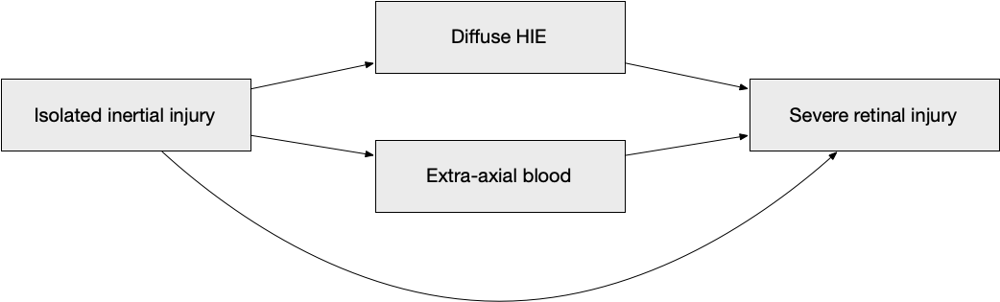
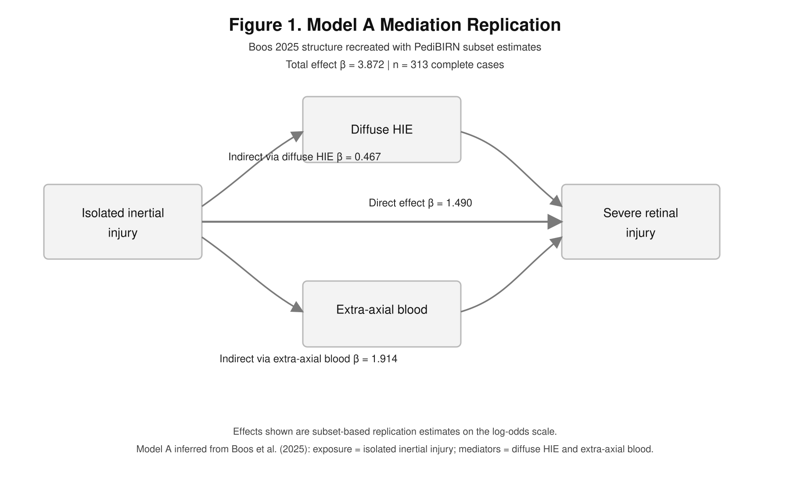

We begin by loading the packages used throughout this replication.

```{r setup}
library(readxl)
library(dplyr)
library(tidyr)
library(knitr)
library(ggplot2)
```

# Overview

This file attempts to replicate the five mediation models from Boos et al. (2025) using the PediBIRN subset available in `../Data/Data.xlsx`.

Because the full analytic codebook and the full 973-record paper dataset were not shared, this replication necessarily involves a few explicit assumptions:

- The analysis is restricted to children with a documented ophthalmology evaluation.
- The outcome is reconstructed as `severe_retinal_injury = 1` if retinoschisis or severe retinal hemorrhage is present.
- Model A is inferred to use `isolated_inertial_injury` as the primary exposure, with `diffuse_HIE` and `extra_axial_blood` as mediators, based on the paper abstract and the intern reconstruction document.
- Models B-E are added here as transparent inferred companion models built from the same Boos variable family, because the full paper's figure definitions could not be recovered directly from the shared materials.
- All five models are fit as simple DAG-based mediation models without additional covariates, because the published figure structure appears to focus on the exposure, the mediators, and the outcome alone.

The goal is therefore not an identical reproduction of the published coefficients, but a transparent subset-based replication of the same basic causal model.

# Data

## Data Source

We now load the control and intervention sheets from the PediBIRN subset and combine them into a single patient-level dataset.

```{r load-data}
data_path <- "../Data/Data.xlsx"

dat_control <- read_excel(data_path, sheet = "Eligible Control Patients") |>
  mutate(data_source = "control")

dat_intervention <- read_excel(data_path, sheet = "Eligible Intervention Patients") |>
  mutate(data_source = "intervention")

dat_raw <- bind_rows(dat_control, dat_intervention)

nrow(dat_raw)
```

This subset contains fewer records than the published paper dataset, so the coefficients should be treated as approximate rather than expected to match exactly.

## Variable Reconstruction

We now reconstruct the mediation-model variables using the mappings described in `Boos2025.pdf` and the intern reconstruction document.

```{r reconstruct-variables}
col_prefix <- function(prefix) {
  match_idx <- which(startsWith(names(dat_raw), prefix))[1]
  if (is.na(match_idx)) {
    stop(paste("No column found with prefix:", prefix))
  }
  names(dat_raw)[match_idx]
}

col_contains <- function(text) {
  match_idx <- grep(text, names(dat_raw), ignore.case = TRUE)[1]
  if (is.na(match_idx)) {
    stop(paste("No column found containing:", text))
  }
  names(dat_raw)[match_idx]
}

feature_map <- c(
  age_months = col_prefix("Q2.3.1."),
  respiratory_compromise = col_prefix("Q4.2.1."),
  circulatory_compromise = col_prefix("Q4.2.2."),
  seizure = col_prefix("Q4.2.3."),
  altered_consciousness = col_prefix("Q4.2.4."),
  loc_resolved_before_admission = col_prefix("Q4.2.5."),
  loc_gt24h = col_prefix("Q4.2.6."),
  loc_posturing = col_prefix("Q4.2.7."),
  craniofacial_injury = col_prefix("Q4.3.1."),
  skull_fracture = col_prefix("Q4.4.1."),
  epidural_hemorrhage = col_prefix("Q4.4.3."),
  subdural_hemorrhage = col_prefix("Q4.4.4."),
  sdh_bilateral = col_prefix("Q4.4.5.2."),
  sdh_interhemispheric = col_contains("interhemispheric space"),
  subarachnoid_hemorrhage = col_prefix("Q4.4.7."),
  hie_any = col_prefix("Q4.4.12."),
  hie_depth = col_prefix("Q4.4.13."),
  hie_distribution = col_prefix("Q4.4.14."),
  ophthalmology_eval = col_prefix("Q5.3.1.10."),
  retinoschisis = col_prefix("Q5.3.2.8."),
  severe_rh = col_prefix("Q5.3.2.9.")
)

mediation_data <- dat_raw |>
  transmute(
    age_months = as.numeric(.data[[feature_map["age_months"]]]),
    respiratory_compromise = as.integer(.data[[feature_map["respiratory_compromise"]]]),
    circulatory_compromise = as.integer(.data[[feature_map["circulatory_compromise"]]]),
    seizure = as.integer(.data[[feature_map["seizure"]]]),
    altered_consciousness = as.integer(.data[[feature_map["altered_consciousness"]]]),
    loc_resolved_before_admission = as.integer(.data[[feature_map["loc_resolved_before_admission"]]]),
    loc_gt24h = as.integer(.data[[feature_map["loc_gt24h"]]]),
    loc_posturing = as.integer(.data[[feature_map["loc_posturing"]]]),
    craniofacial_injury = as.integer(.data[[feature_map["craniofacial_injury"]]]),
    skull_fracture = as.integer(.data[[feature_map["skull_fracture"]]]),
    epidural_hemorrhage = as.integer(.data[[feature_map["epidural_hemorrhage"]]]),
    subdural_hemorrhage = as.integer(.data[[feature_map["subdural_hemorrhage"]]]),
    sdh_bilateral = as.integer(.data[[feature_map["sdh_bilateral"]]]),
    sdh_interhemispheric = as.integer(.data[[feature_map["sdh_interhemispheric"]]]),
    subarachnoid_hemorrhage = as.integer(.data[[feature_map["subarachnoid_hemorrhage"]]]),
    hie_any = as.integer(.data[[feature_map["hie_any"]]]),
    hie_depth = as.integer(.data[[feature_map["hie_depth"]]]),
    hie_distribution = as.integer(.data[[feature_map["hie_distribution"]]]),
    ophthalmology_eval = as.integer(.data[[feature_map["ophthalmology_eval"]]]),
    retinoschisis = as.integer(.data[[feature_map["retinoschisis"]]]),
    severe_rh = as.integer(.data[[feature_map["severe_rh"]]])
  ) |>
  mutate(
    severe_retinal_injury = if_else(
      ophthalmology_eval == 1L,
      if_else(retinoschisis == 1L | severe_rh == 1L, 1L, 0L),
      NA_integer_
    ),
    clinical_hypoxia_ischemia = if_else(
      respiratory_compromise == 1L | circulatory_compromise == 1L,
      1L, 0L,
      missing = NA_integer_
    ),
    duration_altered_consciousness = case_when(
      is.na(altered_consciousness) ~ NA_real_,
      altered_consciousness == 0L ~ 0,
      loc_resolved_before_admission == 1L ~ 1,
      altered_consciousness == 1L & loc_gt24h == 0L ~ 2,
      altered_consciousness == 1L & loc_gt24h == 1L & loc_posturing == 0L ~ 3,
      altered_consciousness == 1L & loc_gt24h == 1L & loc_posturing == 1L ~ 4,
      TRUE ~ NA_real_
    ),
    extra_axial_blood = if_else(
      subdural_hemorrhage == 1L | subarachnoid_hemorrhage == 1L,
      1L, 0L,
      missing = NA_integer_
    ),
    diffuse_HIE = if_else(
      hie_any == 1L & (hie_depth == 2L | hie_distribution == 2L),
      1L, 0L,
      missing = NA_integer_
    ),
    inertial_subdural = if_else(
      subdural_hemorrhage == 1L & (sdh_bilateral == 1L | sdh_interhemispheric == 1L),
      1L, 0L,
      missing = NA_integer_
    ),
    inertial_injury = if_else(
      altered_consciousness == 1L | inertial_subdural == 1L,
      1L, 0L,
      missing = NA_integer_
    ),
    contact_injury = if_else(
      craniofacial_injury == 1L | skull_fracture == 1L | epidural_hemorrhage == 1L,
      1L, 0L,
      missing = NA_integer_
    ),
    isolated_inertial_injury = if_else(
      inertial_injury == 1L & contact_injury == 0L,
      1L, 0L,
      missing = NA_integer_
    )
  )

analysis_vars <- c(
  "severe_retinal_injury",
  "isolated_inertial_injury",
  "inertial_injury",
  "clinical_hypoxia_ischemia",
  "diffuse_HIE",
  "duration_altered_consciousness",
  "extra_axial_blood",
  "seizure"
)

oph_subset <- mediation_data |>
  filter(ophthalmology_eval == 1L)

summary_tbl <- tibble(
  variable = analysis_vars,
  n_non_missing = sapply(oph_subset[analysis_vars], function(x) sum(!is.na(x))),
  mean = sapply(oph_subset[analysis_vars], function(x) mean(x, na.rm = TRUE))
)

kable(summary_tbl, digits = 3, caption = "Table 1. Reconstructed mediation-model variables in the ophthalmology subset")
```

This table checks that the reconstructed variables behave plausibly in the ophthalmology subset before any mediation modeling is attempted.

# Methods

## Model A

We now fit Model A, using isolated inertial injury as the exposure, diffuse HIE and extra-axial blood as mediators, and severe retinal injury as the outcome.

Statistically, this is implemented here as three logistic regression models. Let \(X_i\) denote isolated inertial injury for child \(i\), let \(M_{1i}\) denote diffuse HIE, let \(M_{2i}\) denote extra-axial blood, and let \(Y_i\) denote severe retinal injury. The fitted models are:

$$
\text{logit}\{\Pr(M_{1i} = 1)\} = \alpha_0 + \alpha_1 X_i + \varepsilon_{1i}
$$

$$
\text{logit}\{\Pr(M_{2i} = 1)\} = \gamma_0 + \gamma_1 X_i + \varepsilon_{2i}
$$

$$
\text{logit}\{\Pr(Y_i = 1)\} = \beta_0 + \beta_1 X_i + \beta_2 M_{1i} + \beta_3 M_{2i} + \varepsilon_{3i}
$$

Under this approximation, the direct effect is represented by \(\beta_1\), while the two indirect effects are summarized by the coefficient products \(\alpha_1 \beta_2\) and \(\gamma_1 \beta_3\).

We now show the same model as a directed acyclic graph.



```{r fit-model-a}
model_a_data <- oph_subset |>
  select(all_of(c("severe_retinal_injury", "isolated_inertial_injury", "diffuse_HIE", "extra_axial_blood"))) |>
  na.omit()

mediator_model_diffuse_hie <- glm(
  diffuse_HIE ~ isolated_inertial_injury,
  data = model_a_data,
  family = binomial()
)

mediator_model_extra_axial <- glm(
  extra_axial_blood ~ isolated_inertial_injury,
  data = model_a_data,
  family = binomial()
)

outcome_model <- glm(
  severe_retinal_injury ~ isolated_inertial_injury + diffuse_HIE + extra_axial_blood,
  data = model_a_data,
  family = binomial()
)
```

This approximation uses logistic regression for both mediators and the outcome, then summarizes indirect effects as products of the relevant log-odds coefficients.

## Models B-E

We now extend the same approximation to four additional inferred models so the document covers the full A-E set discussed in the paper. Because the exact figure definitions were not recoverable from the shared materials, these model specifications should be read as transparent approximations rather than exact reproductions.

```{r model-specifications}
model_specs <- tibble(
  model = c("A", "B", "C", "D", "E"),
  exposure = c(
    "isolated_inertial_injury",
    "inertial_injury",
    "diffuse_HIE",
    "diffuse_HIE",
    "clinical_hypoxia_ischemia"
  ),
  mediators = list(
    c("diffuse_HIE", "extra_axial_blood"),
    c("extra_axial_blood", "clinical_hypoxia_ischemia", "diffuse_HIE", "seizure"),
    c("duration_altered_consciousness", "extra_axial_blood", "clinical_hypoxia_ischemia", "seizure"),
    c("duration_altered_consciousness", "clinical_hypoxia_ischemia", "extra_axial_blood", "seizure"),
    c("duration_altered_consciousness", "diffuse_HIE", "seizure", "extra_axial_blood")
  ),
  description = c(
    "Isolated inertial injury with diffuse HIE and extra-axial blood as mediators.",
    "Inertial injury with or without contact injury, mediated through extra-axial blood, clinical hypoxia or ischemia, diffuse HIE, and seizure.",
    "Diffuse HIE mediated through duration of altered consciousness, extra-axial blood, clinical hypoxia or ischemia, and seizure.",
    "Diffuse HIE versus no HIE or focal HIE, mediated through duration of altered consciousness, clinical hypoxia or ischemia, extra-axial blood, and seizure.",
    "Clinical hypoxia or ischemia mediated through duration of altered consciousness, diffuse HIE, seizure, and extra-axial blood."
  )
)

model_specs_display <- model_specs |>
  mutate(mediators = vapply(mediators, paste, collapse = ", ", character(1)))

kable(model_specs_display, caption = "Table 2. Published Figure A-E specifications used in this replication")
```

This table makes the A-E assumptions explicit before the five models are fit and compared.

## Bootstrap Estimation

We now use a nonparametric bootstrap to summarize the direct and indirect effects for all five inferred models in the same general style as the paper.

```{r bootstrap-effects}
fit_mediator_model <- function(formula, data, mediator_name) {
  mediator_values <- data[[mediator_name]]

  if (all(stats::na.omit(mediator_values) %in% c(0, 1))) {
    glm(formula, data = data, family = binomial())
  } else {
    lm(formula, data = data)
  }
}

fit_effects <- function(df, exposure, mediators) {
  model_df <- df |>
    select(all_of(c("severe_retinal_injury", exposure, mediators))) |>
    na.omit()

  mediator_fits <- lapply(mediators, function(mediator_name) {
    fit_mediator_model(
      reformulate(exposure, response = mediator_name),
      data = model_df,
      mediator_name = mediator_name
    )
  })
  names(mediator_fits) <- mediators

  y <- glm(
    reformulate(c(exposure, mediators), response = "severe_retinal_injury"),
    data = model_df,
    family = binomial()
  )

  indirect_effects <- sapply(mediators, function(mediator_name) {
    unname(coef(mediator_fits[[mediator_name]])[exposure] * coef(y)[mediator_name])
  })

  c(
    setNames(indirect_effects, paste0("indirect__", mediators)),
    direct = unname(coef(y)[exposure]),
    total = unname(sum(indirect_effects) + coef(y)[exposure]),
    n_complete = nrow(model_df)
  )
}

set.seed(123)
n_boot <- 1000

model_results <- lapply(seq_len(nrow(model_specs)), function(i) {
  spec <- model_specs[i, ]
  mediators <- spec$mediators[[1]]

  observed <- fit_effects(
    oph_subset,
    exposure = spec$exposure,
    mediators = mediators
  )

  model_df <- oph_subset |>
    select(all_of(c("severe_retinal_injury", spec$exposure, mediators))) |>
    na.omit()

  boot_names <- c(paste0("indirect__", mediators), "direct", "total")

  boot_effects <- replicate(
    n_boot,
    {
      idx <- sample.int(nrow(model_df), replace = TRUE)
      tryCatch(
        fit_effects(
          model_df[idx, , drop = FALSE],
          exposure = spec$exposure,
          mediators = mediators
        )[boot_names],
        error = function(e) setNames(rep(NA_real_, length(boot_names)), boot_names)
      )
    }
  )

  boot_effects <- t(boot_effects)
  boot_effects <- boot_effects[complete.cases(boot_effects), , drop = FALSE]

  list(
    observed = observed,
    boot = boot_effects,
    model_df = model_df
  )
})

names(model_results) <- model_specs$model

effect_tbl_long <- bind_rows(lapply(seq_len(nrow(model_specs)), function(i) {
  spec <- model_specs[i, ]
  observed <- model_results[[spec$model]]$observed
  boot_effects <- model_results[[spec$model]]$boot
  mediators <- spec$mediators[[1]]
  effect_names <- c(paste0("indirect__", mediators), "direct", "total")

  tibble(
    model = spec$model,
    exposure = spec$exposure,
    effect = effect_names,
    estimate = as.numeric(observed[effect_names]),
    se = apply(boot_effects[, effect_names, drop = FALSE], 2, sd),
    ci_lower = apply(boot_effects[, effect_names, drop = FALSE], 2, quantile, probs = 0.025),
    ci_upper = apply(boot_effects[, effect_names, drop = FALSE], 2, quantile, probs = 0.975),
    n_complete = as.integer(observed["n_complete"])
  )
}))

effect_tbl_display <- effect_tbl_long |>
  mutate(
    effect = sub("^indirect__", "Indirect via ", effect),
    effect = gsub("_", " ", effect),
    effect = if_else(effect == "direct", "Direct", effect),
    effect = if_else(effect == "total", "Total", effect)
  )

kable(effect_tbl_display, digits = 3, caption = "Table 3. Bootstrapped direct and indirect effects for published Figure A-E models")
```

This table is the main model-comparison target. The estimates are in log-odds units, so they are most comparable to the coefficients reported in the Boos paper.

# Results

## Model Comparison

We now compare the direct and indirect effects across Models A-E to see which inferred causal structure is most explanatory in this subset.

```{r model-comparison-plot}
#| fig-cap: "Direct and total effects across inferred Models A-E."
effect_plot_tbl <- effect_tbl_long |>
  select(model, effect, estimate) |>
  filter(effect %in% c("direct", "total")) |>
  mutate(effect_type = effect)

ggplot(effect_plot_tbl, aes(x = model, y = estimate, fill = effect_type)) +
  geom_col(position = "dodge") +
  labs(
    title = "Direct and total effects across models",
    x = "Model",
    y = "Effect estimate (log-odds)",
    fill = NULL
  ) +
  theme_minimal()
```

This figure helps show whether Model A remains the strongest specification in the subset, or whether one of the other published figure structures captures more of the retinal-injury signal.

## Comparison With Boos et al.

We now compare our subset-based estimates with the published coefficients shown in Figures A-E. This lets us see, model by model, whether the subset reproduces the overall pattern of direct and mediated effects even if the numerical values are not identical.

```{r compare-with-boos}
boos_effect_tbl <- tibble::tribble(
  ~model, ~effect, ~boos_estimate,
  "A", "indirect__diffuse_HIE", 0.834,
  "A", "indirect__extra_axial_blood", 0.503,
  "A", "direct", 2.431,
  "A", "total", 3.768,
  "B", "indirect__extra_axial_blood", 0.464,
  "B", "indirect__clinical_hypoxia_ischemia", 0.448,
  "B", "indirect__diffuse_HIE", 0.386,
  "B", "indirect__seizure", 0.272,
  "B", "direct", 1.701,
  "B", "total", 3.271,
  "C", "indirect__duration_altered_consciousness", 0.589,
  "C", "indirect__extra_axial_blood", 0.273,
  "C", "indirect__clinical_hypoxia_ischemia", 0.268,
  "C", "indirect__seizure", 0.190,
  "C", "direct", 0.936,
  "C", "total", 2.256,
  "D", "indirect__duration_altered_consciousness", 0.486,
  "D", "indirect__clinical_hypoxia_ischemia", 0.295,
  "D", "indirect__extra_axial_blood", 0.270,
  "D", "indirect__seizure", 0.184,
  "D", "direct", 0.889,
  "D", "total", 2.124,
  "E", "indirect__duration_altered_consciousness", 0.591,
  "E", "indirect__diffuse_HIE", 0.437,
  "E", "indirect__seizure", 0.200,
  "E", "indirect__extra_axial_blood", 0.137,
  "E", "direct", 0.604,
  "E", "total", 1.969
) |>
  left_join(
    effect_tbl_long |>
      select(model, effect, subset_estimate = estimate),
    by = c("model", "effect")
  ) |>
  mutate(
    absolute_difference = subset_estimate - boos_estimate,
    percent_of_boos = 100 * subset_estimate / boos_estimate,
    effect = sub("^indirect__", "Indirect via ", effect),
    effect = gsub("_", " ", effect),
    effect = if_else(effect == "direct", "Direct", effect),
    effect = if_else(effect == "total", "Total", effect)
  )

kable(
  boos_effect_tbl,
  digits = 3,
  caption = "Table 4. Comparison of subset-based estimates with the published Boos Figure A-E coefficients"
)
```

Table 4 is meant to show whether the subset-based replication lands in the same general range as the published figures, even though the subset is smaller and some variable definitions remain reconstructed rather than verified from the full study codebook.

## Model A Outcome-Model Coefficients

We now display the fitted Model A outcome coefficients so it is clear which variables are driving the direct and mediated paths in the closest paper-match specification.

```{r outcome-coefficients}
outcome_coef_tbl <- as.data.frame(coef(summary(outcome_model))) |>
  tibble::rownames_to_column("term") |>
  rename(
    estimate = Estimate,
    std_error = `Std. Error`,
    statistic = `z value`,
    p_value = `Pr(>|z|)`
  )

kable(outcome_coef_tbl, digits = 3, caption = "Table 5. Model A outcome-model coefficients")
```

This table is helpful because it separates the direct effect of isolated inertial injury from the associations of the two mediators with severe retinal injury.

## Effect Plot

We now plot the Model A direct and indirect effects to make the relative sizes easier to compare visually.

```{r effect-plot}
#| fig-cap: "Bootstrapped direct and indirect effects for inferred Model A."
effect_tbl_model_a <- effect_tbl_long |>
  filter(model == "A") |>
  mutate(
    ci_lower = apply(model_results[["A"]]$boot[, effect, drop = FALSE], 2, quantile, probs = 0.025),
    ci_upper = apply(model_results[["A"]]$boot[, effect, drop = FALSE], 2, quantile, probs = 0.975)
  ) |>
  select(effect, estimate, ci_lower, ci_upper) |>
  mutate(
    effect = recode(
      effect,
      "indirect__diffuse_HIE" = "Indirect via diffuse_HIE",
      "indirect__extra_axial_blood" = "Indirect via extra_axial_blood",
      direct = "Direct",
      total = "Total"
    )
  )

ggplot(effect_tbl_model_a, aes(x = effect, y = estimate)) +
  geom_col(fill = "#3C6E71") +
  geom_errorbar(aes(ymin = ci_lower, ymax = ci_upper), width = 0.15) +
  geom_hline(yintercept = 0, linetype = "dashed", color = "grey40") +
  labs(
    title = "Direct and indirect effects",
    x = NULL,
    y = "Effect estimate (log-odds)"
  ) +
  theme_minimal()
```

This figure helps show whether Model A is being driven mainly by the direct path from isolated inertial injury to severe retinal injury, or by the indirect paths through diffuse HIE and extra-axial blood.

## Recreated Figure 1

We now recreate the first Boos 2025 mediation figure using the subset-based Model A estimates from this replication.



# Discussion

This replication should be read as an informed approximation, not as a definitive reproduction of the published Boos 2025 mediation model. The main reasons are that the full paper dataset was not available, the exact mediation-figure specification could only be inferred from the paper abstract and snippets, and some variable definitions, especially the HIE depth and distribution mapping, remain partly reconstructed rather than verified from a codebook.

Within those limits, this file provides a transparent first-pass implementation of the model that appears to be summarized in the abstract: isolated inertial injury as the primary exposure, diffuse HIE and extra-axial blood as mediators, and severe retinal injury as the outcome among children with ophthalmology examinations.

# Next Steps

- Check the paper PDF directly against the inferred Model A structure and confirm whether the published Figure 1 corresponds to this simpler DAG-based specification.
- Compare the estimates here against the abstract values for direct and indirect effects.
- If needed, refine the inferred B-E specifications once the full figure definitions can be confirmed from the paper.
